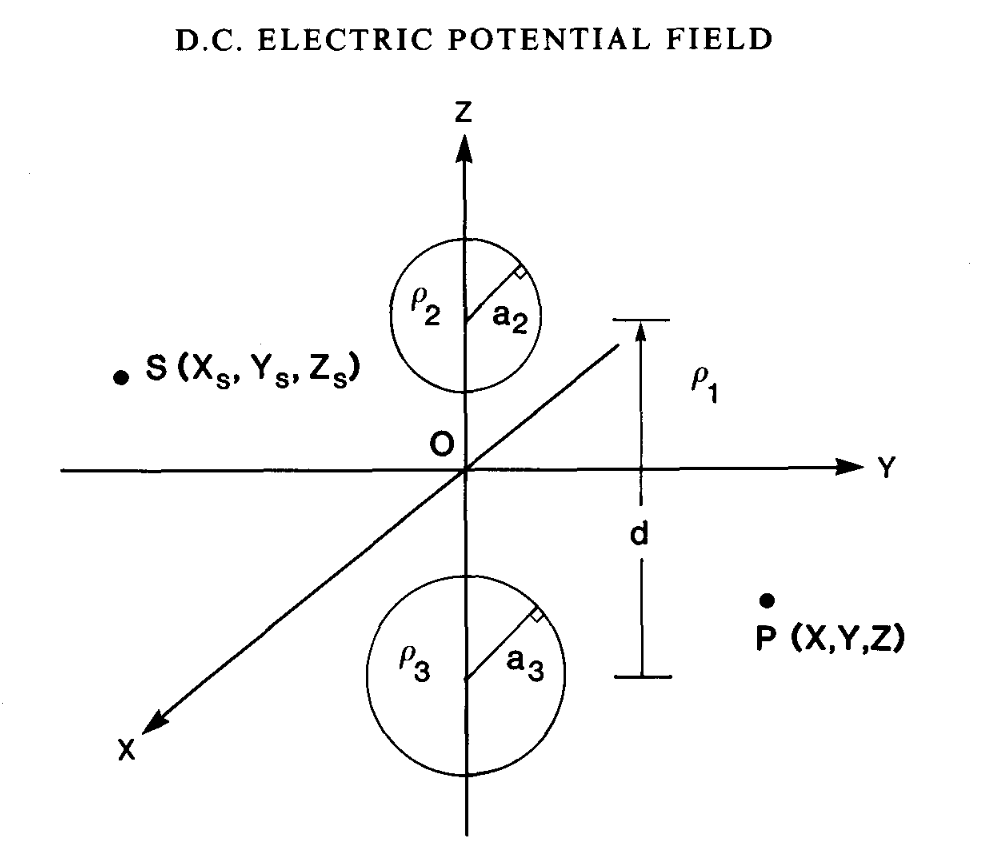

# Direct Current electri potential field associated with two spherical conductors in a whole-space

Please use the following as a template for the 
```
# Template repository for papers

_Authors_

[https://doi.org/XXX](https://doi.org/XXX)



## Summary

Summary of the paper here (pulled from abstract/summary of paper) 

## Citation

Please include the formatted citation along with bibtex for the reference

```

## Examples
- https://github.com/ubcgif/2023-heagy-oldenburg-gji-casing-permeability
- https://github.com/ubcgif/2024-heagy-etal-tle-future-of-applied-geophysics
